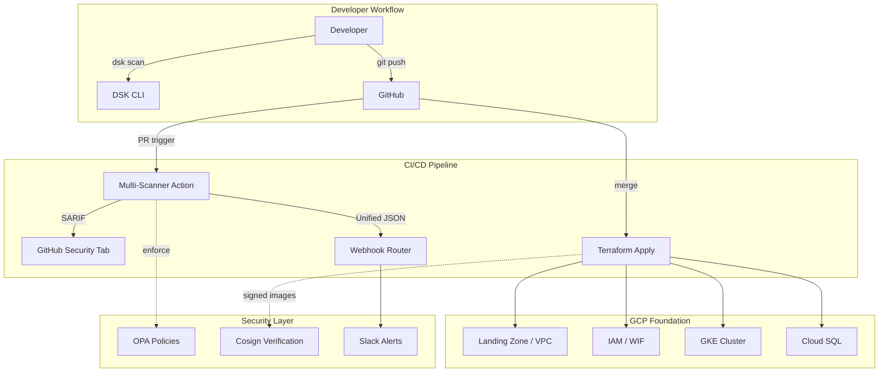
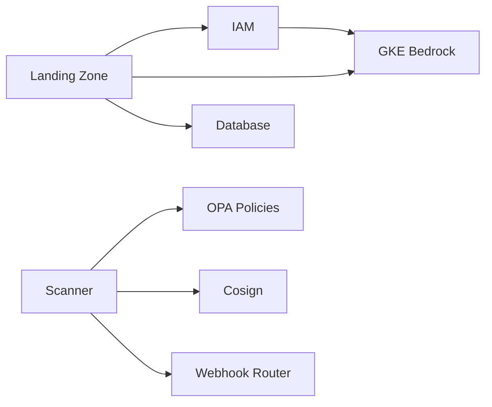

# Architecture Overview

How the DevSecOps Starter Kit fits together.

## System Architecture



## Design Principles

### 1. Secure by Default

Every module ships with the secure configuration as the default. Insecure options require explicit opt-in:

```hcl
# You have to deliberately enable a public IP — it's off by default
enable_public_ip = false  # default
```

### 2. Progressive Disclosure (Good / Better / Best)

Each module has three tiers of complexity:

| Tier | What You Get | Who It's For |
|------|-------------|--------------|
| **Good** (Free) | Functional, secure, opinionated | Anyone on GitHub |
| **Better** (Starter/Growth) | Multi-tenant, advanced features, customizable | Paying teams |
| **Best** (Enterprise) | Customized to your org, advisory included | Large orgs |

### 3. Composable Modules

Modules are independent but designed to work together:



You can use any module standalone, but the full stack multiplies the value.

### 4. GitOps Native

All configuration lives in Git. Infrastructure state in Terraform. Policies in Rego. Scanning in GitHub Actions. No ClickOps, no consoles, no manual steps.

## Technology Stack

| Layer | Technology | Why |
|-------|-----------|-----|
| Infrastructure | Terraform (HCL) | Industry standard, declarative, stateful |
| CI/CD | GitHub Actions | Where your code already lives |
| Policy | OPA / Rego | Most expressive policy language for IaC |
| Signing | Cosign / Sigstore | Keyless, OIDC-native, zero key management |
| CLI | Go (Cobra) | Single binary, cross-platform, fast |
| Services | Python (FastAPI) | Rapid development for webhook router, portals |
| Docs | MkDocs Material | Best-in-class for infrastructure documentation |
| Cloud | GCP | Primary target (GKE, Cloud SQL, IAM, VPC) |

## Release Roadmap

| Release | Focus | Timeline |
|---------|-------|----------|
| **R1: Foundation** | Landing Zone, IAM, Scanner, Policies, CLI, Docs | Building now |
| **R2: Pipeline** | GKE, Database, Drift Detection, WAF, SOC2 | Next |
| **R3: Enterprise** | Vault, Backstage, Ephemeral Envs, Dashboards | Later |
| **SecureRange** | Vulnerable labs for security training | Parallel |
