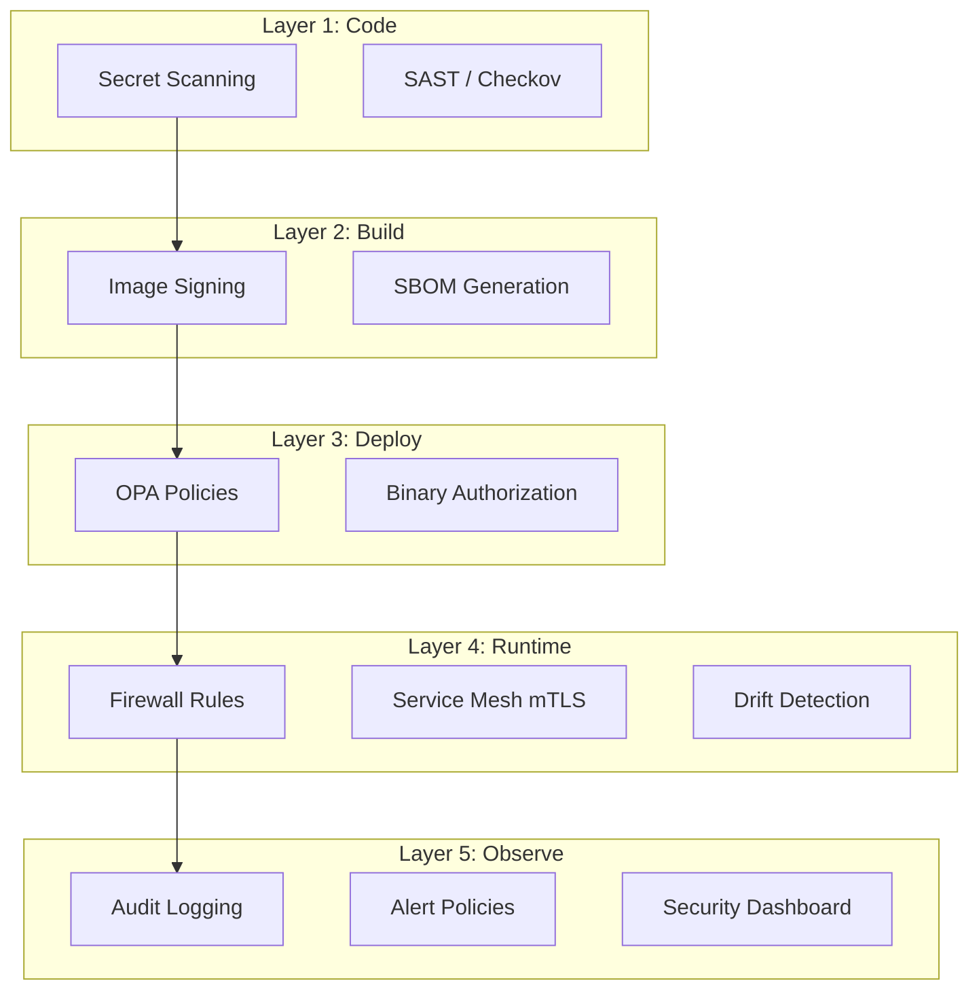

# Security Model

How the DevSecOps Starter Kit enforces security at every layer.

## Non-Negotiable Requirements

These apply to **every module, every tier, every commit**:

| # | Requirement | Enforcement |
|---|-------------|-------------|
| 1 | Zero hardcoded secrets | TruffleHog in CI + `dsk validate` pre-commit |
| 2 | Workload Identity Federation | No SA key files — OIDC authentication for CI/CD |
| 3 | Default-deny networking | Every VPC starts with deny-all ingress |
| 4 | Least-privilege IAM | No `roles/editor` or `roles/owner` on service accounts |
| 5 | Encryption at rest and in transit | All storage encrypted, SSL enforced on all connections |
| 6 | Container image signing | Cosign keyless signing on every image build |
| 7 | Audit logging enabled | Cloud Audit Logs on every project |
| 8 | SARIF output standard | All scanners output SARIF for unified processing |
| 9 | Terraform module standards | Required variables, outputs, descriptions, validation |
| 10 | GitHub Actions security | Pinned action SHAs, minimal permissions, no `pull_request_target` |

## Defense in Depth

Each layer catches what the previous one missed:

- **Code:** Catch secrets and misconfigs before merge
- **Build:** Sign images, generate SBOMs
- **Deploy:** Enforce policies, require attestations
- **Runtime:** Network isolation, mTLS, drift detection
- **Observe:** Logging, alerting, dashboards

## Threat Model

| Threat | Mitigation |
|--------|-----------|
| Leaked credentials | TruffleHog + WIF (no keys to leak) |
| Supply chain attack | Cosign signing + SLSA provenance + pinned Actions |
| Infrastructure misconfiguration | OPA policies + Checkov + CIS Benchmarks |
| Privilege escalation | Least-privilege IAM + no `roles/owner` |
| Data exfiltration | VPC-SC perimeters + deny-all firewalls + audit logging |
| Container compromise | Binary Authorization + read-only root + no privileged |
| Drift from desired state | Weekly `terraform plan` + Cloud Asset Inventory |
