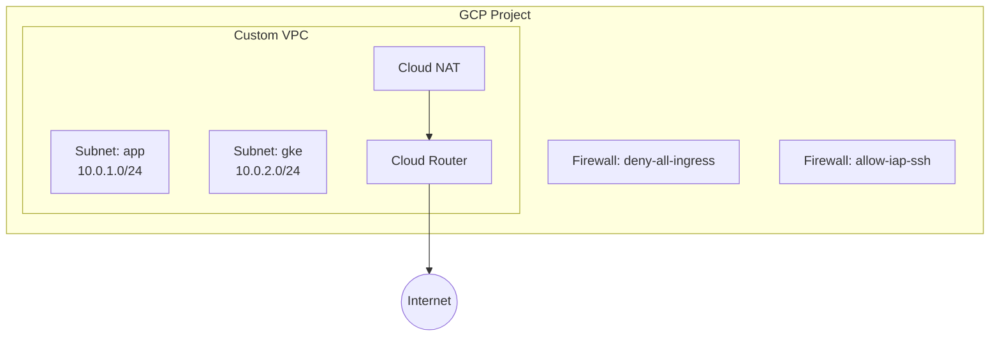

# Landing Zone

Secure GCP networking foundation: custom VPC, subnets, Cloud NAT, and firewall rules.

## What It Does

Replaces the default GCP network with a hardened custom VPC:

- **Custom VPC** with configurable subnets (app, data, GKE)
- **Cloud NAT** for outbound internet access without public IPs
- **Deny-all ingress firewall** with explicit allow rules
- **IAP SSH access** instead of public SSH
- **Private Google Access** on all subnets



## Usage

```hcl
module "landing_zone" {
  source = "github.com/Nturdsh27/Cloud-IaC//modules/foundation/landing-zone"

  project_id = "your-project-id"
  region     = "us-central1"

  vpc_name = "main"
  subnets = {
    app = { cidr = "10.0.1.0/24", region = "us-central1" }
    gke = {
      cidr             = "10.0.2.0/24"
      region           = "us-central1"
      secondary_ranges = {
        pods     = "10.4.0.0/14"
        services = "10.8.0.0/20"
      }
    }
  }

  enable_cloud_nat             = true
  enable_private_google_access = true
}
```

## Inputs

| Variable | Type | Default | Description |
|----------|------|---------|-------------|
| `project_id` | `string` | — | GCP project ID |
| `region` | `string` | — | Primary region |
| `vpc_name` | `string` | `"main"` | VPC network name |
| `subnets` | `map(object)` | — | Subnet definitions with CIDR and region |
| `enable_cloud_nat` | `bool` | `true` | Enable Cloud NAT for outbound |
| `enable_private_google_access` | `bool` | `true` | Enable Private Google Access |
| `enable_flow_logs` | `bool` | `false` | Enable VPC flow logs (Better tier) |

## Outputs

| Output | Description |
|--------|-------------|
| `network_id` | VPC network self-link |
| `subnet_ids` | Map of subnet name → self-link |
| `nat_ip` | Cloud NAT external IP |

## Security Controls

- [x] Default VPC deleted (replaced by custom)
- [x] Deny-all ingress firewall as base rule
- [x] SSH only via IAP (no public SSH)
- [x] Private Google Access enabled
- [x] Cloud NAT — no public IPs on instances

## What the Paid Tier Adds

The **Starter/Growth** tier extends this module with:

- **Shared VPC** — host/service project model for multi-team isolation
- **Hierarchical firewalls** — org/folder-level policy enforcement
- **VPC Flow Logs** — network forensics and audit
- **Multi-project hierarchy** — prod/staging/dev folder structure
